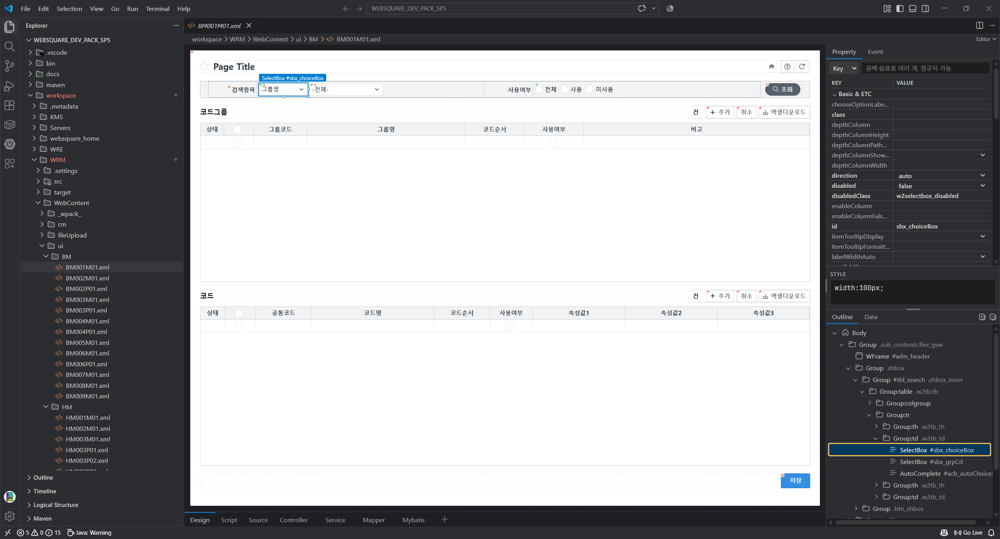
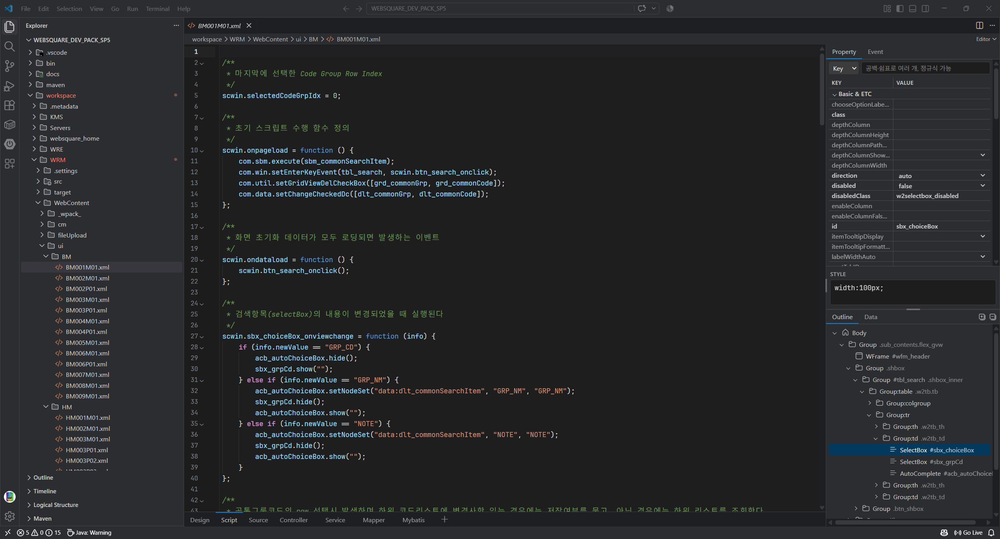
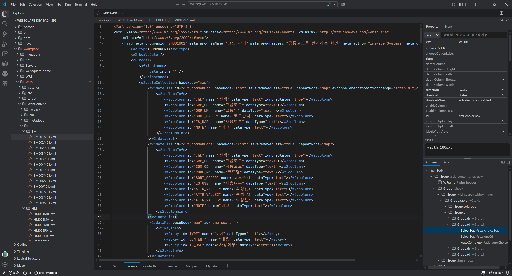
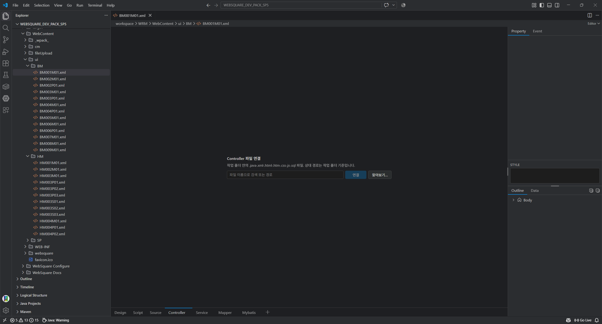
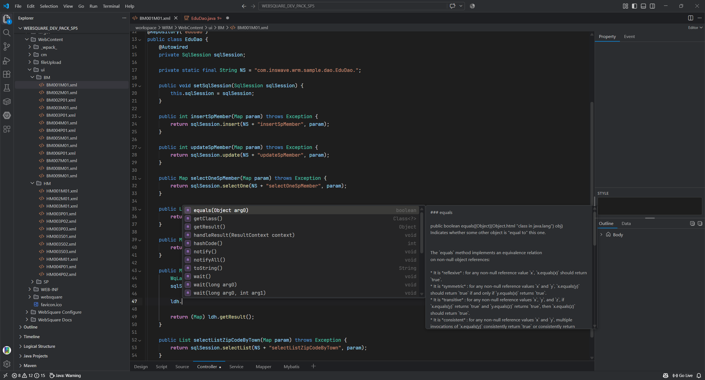

# For Websquare5

VS Code에서 WebSquare5 에디터를 사용할 수 있게 해주는 **비공식** 확장입니다.

화면 XML을 Design·Script·Source로 열어 편집하고, Controller·Service·Mapper·MyBatis 파일을 같은 화면의 탭으로 연결해 한 창에서 작업합니다.



> 스크린샷의 화면은 [WebSquare5 교육용 개발팩](https://media.inswave.kr/edu/WEBSQUARE_DEV_PACK_SP5_edu.zip)의 샘플 프로젝트를 연 것입니다. 샘플 화면·코드의 저작권은 Inswave Systems에 있습니다.

---

## 개발 배경

실무에서 가장 불편했던 것은 **과도한 툴 분리와 컨텍스트 스위칭**이었습니다.

- **Frontend**: Eclipse (WebSquare Studio)
- **Backend**: IntelliJ / Zed
- **Database**: DBeaver
- 여기에 Java/Spring의 수많은 파일(Controller, Service, Mapper, XML 등)까지 겹쳐 창과 탭 전환에 피로감이 컸습니다.

> "VS Code 하나로 WebSquare와 백엔드를 같이 개발할 수는 없을까?"

Eclipse + WebSquare 환경의 사용 흐름을 참고해 VS Code 확장으로 만들었습니다.

---

## 주요 기능

### 화면 디자이너

`*.xml`을 열면 WebSquare 화면은 디자이너로, 그 외 XML은 일반 텍스트 편집기로 열립니다.

- **Design 탭**: 프로젝트 CSS를 적용한 화면 미리보기, 컴포넌트 선택·크기 조절, 복사·붙여넣기·삭제, 그리드 열 너비 조절
- **Property / Event 패널**: 속성·이벤트 검색과 편집, 여러 컴포넌트 동시 편집
- **Outline / Data 패널**: 컴포넌트 트리, DataCollection·Submission 트리, 드래그 앤 드롭 이동·바인딩
- **팔레트**: Activity Bar의 WebSquare5 사이드바에서 컴포넌트를 검색해 화면에 삽입
- **Event → Script**: 이벤트 값을 더블클릭하면 `scwin.{id}_{이벤트}` 함수 뼈대를 만들거나 해당 함수로 이동

XML 원문은 바뀐 부분만 교체하고, 저장·Undo는 VS Code 방식 그대로 동작합니다.

### 코드 편집 (Source · Script)





- XML·WebSquare API·공통 JS 자동완성과 마우스 오버 설명
- 문법 오류 표시, 포맷(Prettier), 검색, 줄바꿈(VS Code 설정을 따름)
- 코드 편집기 테마 선택, Git 변경 줄 표시

### 연결 파일 (Controller · Service · Mapper · MyBatis)

화면 아래 탭에서 Java·XML·SQL 등 연결 파일을 열어 편집합니다. 탭 목록과 순서는 직접 바꿀 수 있습니다.





- 작업 폴더 안 파일을 이름으로 검색해 연결
- VS Code에 설치된 언어 확장(Java 등)의 자동완성·포맷 결과 사용
- MyBatis 매퍼의 SQL 색·키워드 자동완성. 설정 `websquare5-editor.sqlDialect`로 DB 방언을 고릅니다 (`standard`(기본)·`oracle`·`mysql`·`mariadb`·`postgresql`·`mssql`·`sqlite`)

### 저장

저장하면 wpack 변환이 실행되어 JS 산출물이 갱신됩니다.

---

## 사용 전 준비

이 확장은 **사용 권한이 있는 WebSquare5 환경** 위에서 동작합니다.

- VS Code 1.138 이상
- WebSquare5 프로젝트 (작업 폴더에 `websquare/config.xml`이 있는 구조)
- WebSquare5 설정 파일이 들어 있는 폴더 (컴포넌트 정의 `WebSquareConfig.xml`, wpack 변환기, API 문서를 이 폴더 밑에서 읽습니다. 예: 전자정부프레임워크 4.1 기준 `eclipse_egov4.1/`). 못 찾으면 팔레트와 Property·Event 패널이 비고, 저장 시 wpack 변환을 건너뜁니다.
- (선택) 연결 파일의 Java 자동완성을 위한 Java 확장

### 설치

[Releases](https://github.com/castle-bird/ForWebsquare5/releases)에서 `.vsix`를 받아 설치합니다.

```bash
code --install-extension websquare5-editor-0.1.0.vsix
```

### 설정

1. VS Code에서 WebSquare5 프로젝트 폴더를 엽니다.
2. `F1` → **WebSquare5: 환경 설정**을 실행하고 위 WebSquare5 설정 파일 폴더를 고릅니다.
3. 그 밑에서 컴포넌트 정의 파일, wpack 변환기, API 문서를 자동으로 찾습니다. 못 찾은 항목은 해당 기능을 쓸 때 알림으로 알려주며, 설정(`websquare5-editor.*`)에서 직접 지정할 수 있습니다.

---

## 100% Vibe Coding

이 프로젝트는 **AI 페어 프로그래밍(Vibe Coding)**으로 설계·구현했습니다. 기획, 아키텍처, 컴포넌트 렌더링, XML 파싱, 상태 관리까지 AI와 대화하고 피드백하며 만들었습니다.

## 현재 상태와 피드백

WebSquare5 교육용 개발팩 기준으로 개발하고 확인했습니다. 엔진 버전이나 배포 방식이 다른 환경에서는 화면 모양이나 동작이 다를 수 있습니다. 자체 렌더러라 실제 엔진과 모양이 다를 수 있고, 일부 컴포넌트는 자리 표시로만 그려집니다.

써 보시고 안 맞는 부분, 필요한 기능은 [Issues](https://github.com/castle-bird/ForWebsquare5/issues)로 알려 주세요.

---

## 참고 자료

공개된 WebSquare 학습 자료와 배포 환경의 동작을 참고해 만들었습니다.

- [WebSquare 공식 유튜브 공개 강의](https://www.youtube.com/watch?v=KEPuK3erXWM&list=PL7a9HhkvOVb09T_2Xdxs4sPgyDjkGlT9G)
- [WebSquare5 교육용 개발팩](https://media.inswave.kr/edu/WEBSQUARE_DEV_PACK_SP5_edu.zip)

## 고지 사항

- **비공식 도구**: 이 확장은 Inswave Systems의 공식 제품이 아니며 Inswave와 무관한 개인 프로젝트입니다. WebSquare는 Inswave Systems의 제품·상표입니다.
- **독립 구현**: WebSquare 엔진·스킨·컴포넌트 정의·wpack·문서·아이콘 등 Inswave의 파일을 이 저장소와 확장에 포함하지 않으며, Studio 소스를 복사·포팅하지 않았습니다. 공개 문서와 실행 결과를 참고해 독립적으로 작성했습니다.
- **WebSquare 환경 의존**: 사용자의 작업 폴더와 설치본의 WebSquare 프로젝트 구조·리소스를 실행 중에 읽습니다. WebSquare 프로젝트가 아닌 환경에서는 XML ↔ JS 변환, 컴포넌트 목록·속성 조회가 동작하지 않습니다.

## 라이선스

[MIT License](LICENSE)
