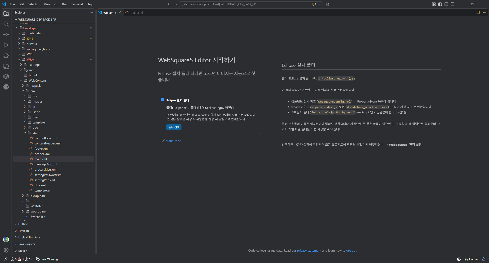
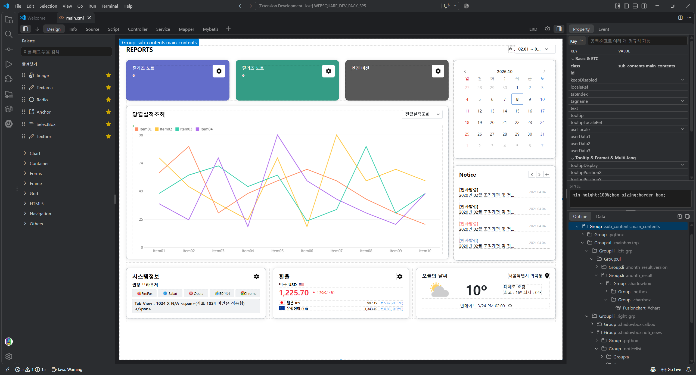

# For Websquare5

VS Code에서 WebSquare5 화면을 편집할 수 있는 확장 프로그램입니다.
사용 권한이 있는 WebSquare5 환경이 필요합니다.

## 사용방법

1. 확장 탭에서 **For Websquare5**를 설치합니다. 직접 설치하려면 [Releases](https://github.com/castle-bird/ForWebsquare5/releases)의 `.vsix`를 사용하세요.
2. `Ctrl+Shift+P`에서 `>Welcome: Open Walkthrough`를 입력하고 **WebSquare5 Editor 시작하기**를 선택합니다.
3. **폴더 선택**에서 WebSquare5 플러그인이 설치된 **Eclipse 폴더**를 선택합니다. 예: `C:\WEBSQUARE_DEV_PACK_SP5\eclipse_egov4.1`
   컴포넌트 정의·wpack·API 문서를 이 폴더에서 자동으로 찾습니다.

화면 XML 파일을 열고 **Design·Info·Script·Source** 탭에서 편집합니다. 저장·Undo는 VS Code 방식 그대로 사용합니다.

WebSquare5 교육자료의 main 파일 화면입니다. 화면과 참고 자료의 출처는 WebSquare5 교육자료입니다.

자세한 기능은 [기능 설명](FEATURES.md), 개발·테스트는 [테스트 실행 안내](scripts/README.md)를 참고하세요.
의견과 버그는 [Issues](https://github.com/castle-bird/ForWebsquare5/issues)로 알려 주세요.

## 고지·라이선스

WebSquare5는 Inswave Systems의 제품이며, 이 확장은 공식 제품이 아닙니다.
Inswave의 파일·Studio 소스를 포함하지 않고, 사용자의 WebSquare5 설치본과 프로젝트 리소스를 참조합니다. 자체 미리보기는 실제 엔진 화면과 다를 수 있습니다.

[MIT License](LICENSE)
